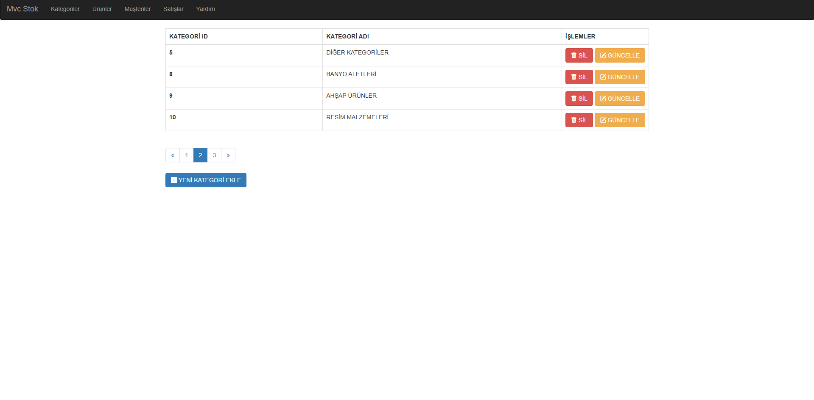
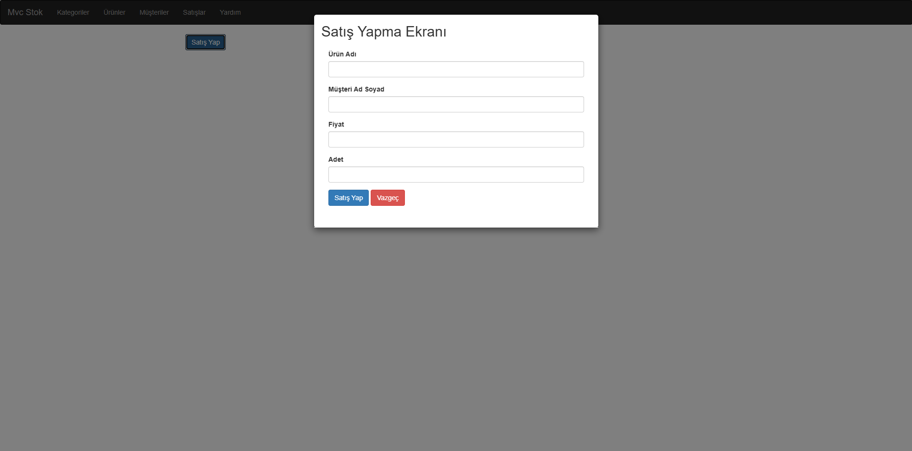

# 50 Derste MVC 📚

Merhaba! 👋

Bu repository, Murat Yücedağ'ın YouTube üzerinde yayınladığı _"50 Derste MVC"_ derslerini içermektedir.  
Eğitim sürecinde öğrendiğim temel konuları, teknolojileri ve yazılım geliştirme yaklaşımlarını uygulamalı olarak burada bir araya getirdim.

## Proje Görselleri 📸

### 📂 Kategoriler Ekranı

  

### 📦 Ürünler Ekranı

  

### ➕ Ürün Ekleme Ekranı

  

### 💰 Satış Yapma Ekranı

  

## Proje Hakkında 🚀

Bu projede, gerçek dünya uygulamalarıyla MVC mimarisinin temellerini öğreniyoruz.  
Amacımız yalnızca teorik bilgi değil, aynı zamanda pratik yetkinlik kazanmak!

## İçerik Başlıkları

- ✅ Model, View, Controller Temelleri  
- ✅ Routing (Yönlendirme) Mantığı  
- ✅ Veritabanı İşlemleri (Entity Framework Core ile)  
- ✅ CRUD Operasyonları  
- ✅ Layout & Partial View Kullanımı  
- ✅ Form İşlemleri  
- ✅ Validasyon ve Hata Yönetimi  
- ✅ İlişkili Tablolar ve LINQ Sorguları  
- ✅ Katmanlı Mimari Yapısı  
- ✅ Temel Authentication & Authorization  

## Kullanılan Teknolojiler 🛠️

- .NET 6.0  
- ASP.NET Core MVC  
- Entity Framework Core  
- MSSQL Server  
- Bootstrap  
- Visual Studio 2022  
